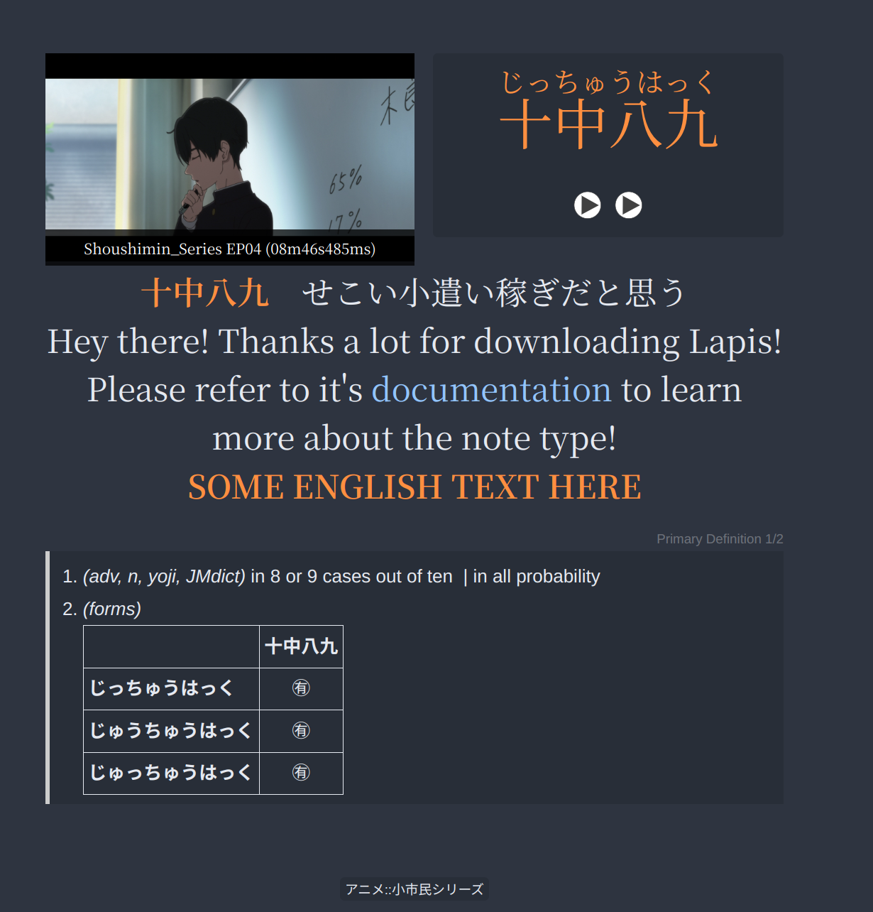

# Lapis

A fork of Lapis that adds some neat features that I personally enjoy:

- "Pitch Accent Graphs" field
  - This is supplied via yomitan
- "Sentence English" field
  - For english translations of sentences
- "Picture" is on the left and captions "MiscInfo"

Verified to work on Anki 25.09
